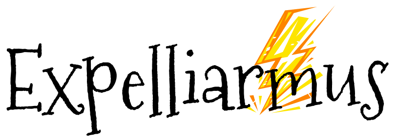

# open-neuromorphic

List of open source neuromorphic projects: SNN training frameworks, DVS handling routines and so on.

## SNN training frameworks

Open-source software to train spiking neural networks.

### snnTorch

[snnTorch](https://github.com/jeshraghian/snntorch) is a SNN training framework for machine learning applications. It is focused on gradient-based training of SNNs. 
It is based on PyTorch for GPU acceleration and gradient computation. 

### norse

Norse aims to exploit the advantages of bio-inspired neural components, which are sparse and event-driven - a fundamental difference from artificial neural networks. Norse expands PyTorch with primitives for bio-inspired neural components, bringing you two advantages: a modern and proven infrastructure based on PyTorch and deep learning-compatible spiking neural network components.

### spikingjelly 

### sinabs

It’s a deep learning library based on PyTorch for spiking neural networks, with a focus on simplicity, fast training and extendability. Sinabs works well for Vision models because of its support for weight transfer.

### rockpool

It’s a deep learning library based on PyTorch for spiking neural networks, with a focus on simplicity, fast training and extendability. Sinabs works well for Vision models because of its support for weight transfer.

### lava

Lava is an open source SW framework to develop applications for neuromorphic hardware architectures. It provides developers with the abstractions and tools to develop distributed and massively parallel applications. These applications can be deployed to heterogeneous system architectures containing conventional processors as well as neuromorphic chips that exploit event-based message passing for communication. The Lava framework comprises high-level libraries for deep learning, constrained optimization, and others for productive algorithm development. It also includes tools to map those algorithms to different types of hardware architectures.

### BindsNET

A Python package used for simulating spiking neural networks (SNNs) on CPUs or GPUs using PyTorch Tensor functionality.

BindsNET is a spiking neural network simulation library geared towards the development of biologically inspired algorithms for machine learning.

### Nengo

The Nengo Brain Maker is a Python package for building, testing, and deploying neural networks.

## Dynamic vision sensors utilities

Open-source software to handle data generated by event-based cameras.

### expelliarmus 

### AEStream 

### aedat

## Hardware

Open-source hardware projects. 

### ODIN

[ODIN](https://github.com/ChFrenkel/ODIN) is an online-learning digital spiking neuromorphic processor designed and prototyped in 28-nm FDSOI CMOS at Université catholique de Louvain (UCLouvain), published in 2019 in the IEEE Transactions on Biomedical Circuits and Systems journal. ODIN is based on a single 256-neuron 64k-synapse crossbar neurosynaptic core with the following key features:

- synapses embed spike-dependent synaptic plasticity (SDSP)-based online learning,
- neurons can phenomenologically reproduce the 20 Izhikevich behaviors.

ODIN is thus a versatile experimentation platform for learning at the edge, while demonstrating (i) record neuron and synapse densities compared to all previously-proposed spiking neural networks (SNNs) and (ii) the lowest energy per synaptic operation across previously-proposed digital SNNs.

### ReckOn

[ReckOn](https://github.com/ChFrenkel/ReckOn) is a spiking recurrent neural network (RNN) processor enabling on-chip learning over second-long timescales based on a modified version of the e-prop algorithm (we released a PyTorch implementation of the vanilla e-prop algorithm for leaky integrate-and-fire neurons here). It was prototyped and measured in 28-nm FDSOI CMOS at the Institute of Neuroinformatics, University of Zurich and ETH Zurich, and published at the 2022 IEEE International Solid-State Circuits Conference (ISSCC) with the following three main claims:

- ReckOn demonstrates end-to-end on-chip learning over second-long timescales while keeping a milli-second temporal resolution,
- it provides a low-cost solution with a 0.45-mm² core area, 5.3pJ/SOP at 0.5V, and a memory overhead of only 0.8% compared to the equivalent inference-only network,
- it exploits a spike-based representation for task-agnostic learning toward user customization and chip repurposing at the edge.

