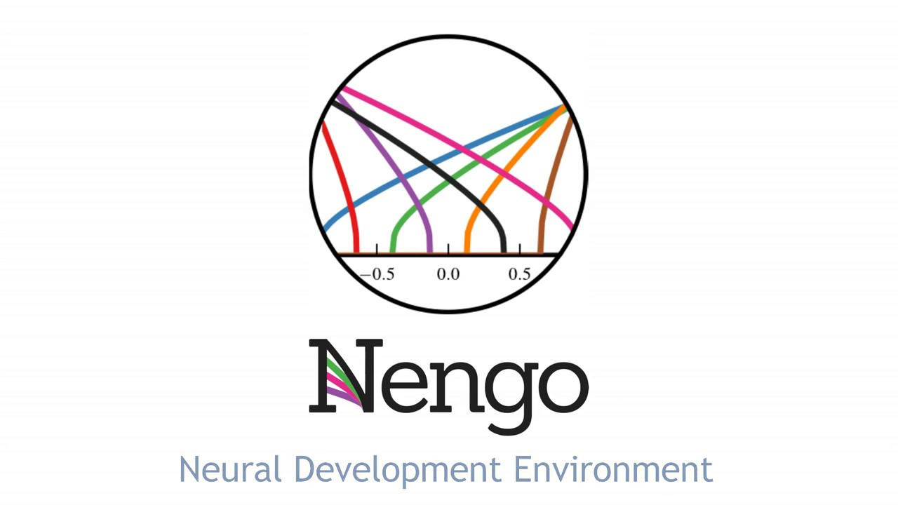

# SNN training frameworks

Open-source software to train spiking neural networks.

## snnTorch

[snnTorch](https://github.com/jeshraghian/snntorch) is a SNN training framework for machine learning applications. It is focused on gradient-based training of SNNs. 
It is based on PyTorch for GPU acceleration and gradient computation. 

## norse

Norse aims to exploit the advantages of bio-inspired neural components, which are sparse and event-driven - a fundamental difference from artificial neural networks. Norse expands PyTorch with primitives for bio-inspired neural components, bringing you two advantages: a modern and proven infrastructure based on PyTorch and deep learning-compatible spiking neural network components.

## spikingjelly 

## lava

Lava is an open source SW framework to develop applications for neuromorphic hardware architectures. It provides developers with the abstractions and tools to develop distributed and massively parallel applications. These applications can be deployed to heterogeneous system architectures containing conventional processors as well as neuromorphic chips that exploit event-based message passing for communication. The Lava framework comprises high-level libraries for deep learning, constrained optimization, and others for productive algorithm development. It also includes tools to map those algorithms to different types of hardware architectures.

## Nengo

The Nengo Brain Maker is a Python package for building, testing, and deploying neural networks.

